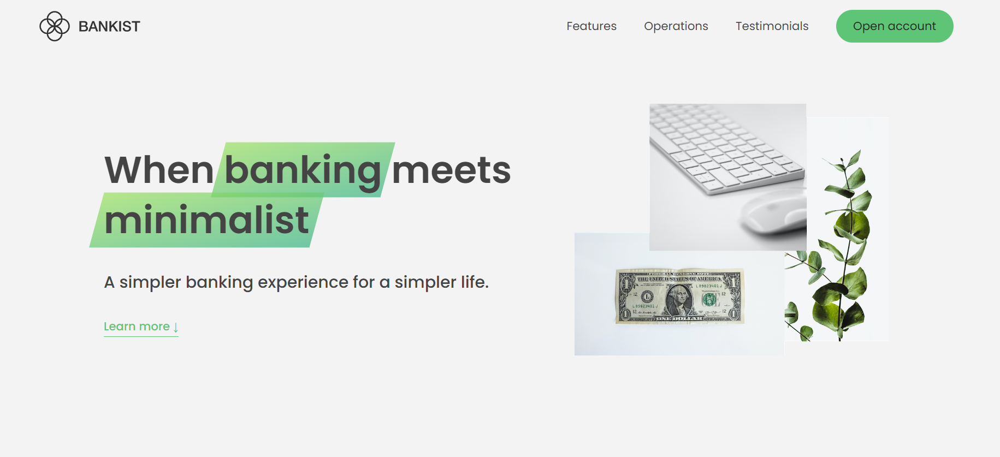
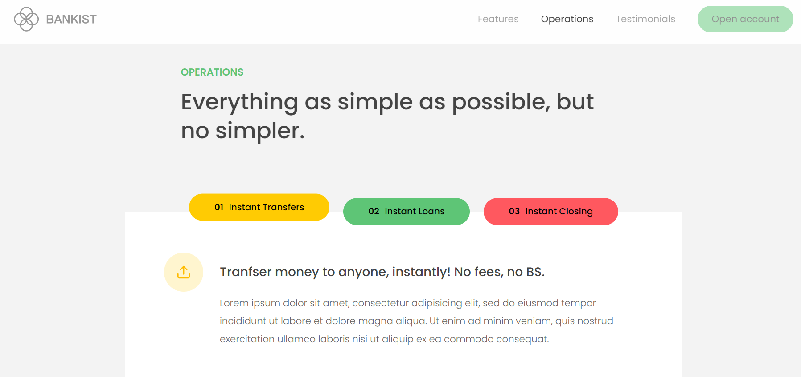
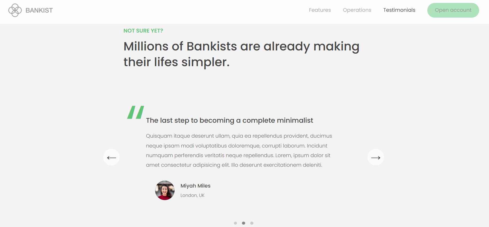

# Bankist Landing Page

A simple Landing Page that simulates a Bank website. Built using Vanilla JavaScript, HTML, and CSS.





## Features

- Sticky Nav Bar.
- Smooth Scrolling.
- Modal window.
- Slider and Tabbed Operation Component.
- Fully Responsive on all devices.
- Lazy Loading images while Revealing Sections.

## Getting Started

Follow these instructions to get the project up and running on your local machine.

### Prerequisites

Make sure you have a modern web browser installed (e.g., Google Chrome, Mozilla Firefox).

### Installation

1. Clone the repository:

   ```bash
   git clone https://github.com/abozaid01/Bankist.git
   ```

2. Navigate to the project directory:

   ```bash
   cd Bankist
   ```

3. Open the index.html file in your preferred web browser.

## Usage

1. open the application in your web browser.
2. Use the buttons to discover the bank landing page.
3. Enjoy using the banking landing page!

## Contributing

Contributions are welcome! If you find a bug or want to add a new feature, please follow these steps:

1. Fork the repository.
2. Create a new branch: git checkout -b feature-name
3. Make your changes and commit them: git commit -m 'Add some feature'
4. Push the branch: git push origin feature-name
5. Create a pull request.

## Acknowledgments

This project was part of Jonas Schmedtmann's Udemy course: [The Complete JavaScript Course 2023: From Zero to Expert!](https://www.udemy.com/course/the-complete-javascript-course/), and it was created for educational purposes.
